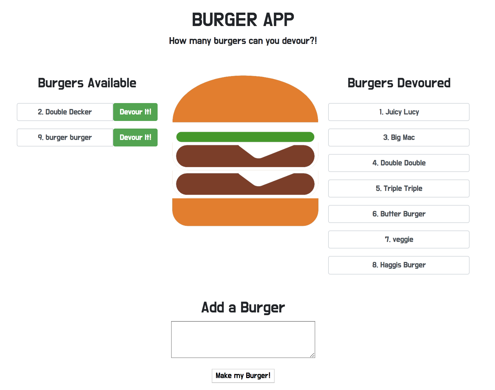

# Eat Da Burger

A Burger Eatin' logger with MySQL, NODE, Express, Handlebars and a homemade ORM. 

## Description
This applicaiton demonstrates a fullstack application with a front end implemented with HTML/CSS and elements from the Bootstrap framework and the backend implemented with Node.js and Express. HTML templating is done with the help of Handlebars.

The user may enter any burger name to add it to the menu. This also adds the new burger entry into the MySQL database (and an extra patty to your growing Burger). The initial burger entry is added as available on the menu on the left side of the screen. The user may then decide to devour any burger by clicking on it, which moves it into the right column and updates its status accordingly in the database. 

## Demo
The demo of the burger eating application can be found [here](https://salty-ravine-74160.herokuapp.com/).


## Installation
To install the application follow the following instruction below:
```javascript
git clone github.com/kmvincent/burger.git
cd burger
npm install
```

## Running Locally
To run the application locally and access it in your browser, first set the PORT environment variable to the value of your choice. An example is shown below.
```javascript
export PORT=3030
```
After the PORT environment variable has been set, run the Node.js application with the command line below.
```javascript
node server.js
```
The application will now be running locally on PORT, in this case that is port 3030. You can then access it locally from your browser at the URL localhost:PORT, in this case localhost:3030.
